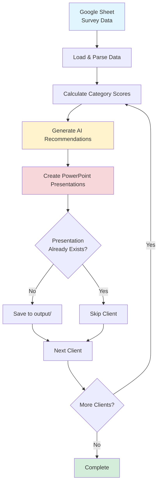
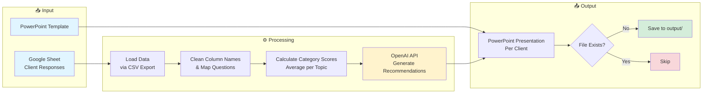
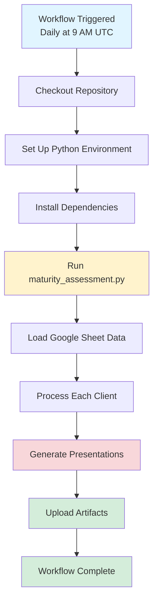

# Marketing Maturity Assessment Automation

Automated system to generate personalized marketing maturity assessment presentations from Google Sheets survey data.

## Process Flow

### High-Level Workflow



### Detailed Data Processing Flow



### GitHub Actions Automation Flow



## Features

- 📊 Loads survey data directly from Google Sheets
- 🎯 Calculates category scores for each client
- 🤖 Generates AI-powered recommendations using OpenAI
- 📑 Creates personalized PowerPoint presentations
- 🎨 Automatically positions score indicators on slides

## Setup

### 1. Install Dependencies

```bash
pip install -r requirements.txt
```

### 2. Set OpenAI API Key

Set your OpenAI API key as an environment variable:

```bash
export OPENAI_API_KEY='your-api-key-here'
```

Or add it to your `~/.zshrc` (or `~/.bashrc`) for persistence:

```bash
echo "export OPENAI_API_KEY='your-api-key-here'" >> ~/.zshrc
source ~/.zshrc
```

### 3. Configure Google Sheet

Update the `SHEET_ID` and `GID` in `maturity_assessment.py` if using a different Google Sheet.

## Usage

### Run the Script

```bash
python maturity_assessment.py
```

Or make it executable and run directly:

```bash
chmod +x maturity_assessment.py
./maturity_assessment.py
```

### Output

Generated PowerPoint presentations will be saved in the `output/` directory with filenames like:
- `client_email_at_domain_com_Maturity_Assessment.pptx`

## Scheduling

### GitHub Actions (Recommended)

Automatically run the script daily using GitHub Actions:

1. **Set up the secret:**
   - Go to your repository on GitHub
   - Click **Settings** → **Secrets and variables** → **Actions**
   - Click **New repository secret**
   - Name: `OPENAI_API_KEY`
   - Value: Your OpenAI API key
   - Click **Add secret**

2. **The workflow is already configured:**
   - The workflow file is at `.github/workflows/daily-assessment.yml`
   - It runs daily at 9:00 AM UTC
   - You can manually trigger it from the **Actions** tab

3. **Access generated files:**
   - Go to the **Actions** tab after a run completes
   - Click on the latest run
   - Download the `maturity-assessments` artifact to get all generated presentations

4. **Adjust schedule (optional):**
   - Edit `.github/workflows/daily-assessment.yml`
   - Change the cron schedule: `'0 9 * * *'` (9 AM UTC daily)
   - Cron format: `minute hour day month day-of-week`
   - Example: `'0 14 * * *'` = 2 PM UTC daily

### macOS (using launchd)

1. Create a plist file at `~/Library/LaunchAgents/com.maturity.assessment.plist`:

```xml
<?xml version="1.0" encoding="UTF-8"?>
<!DOCTYPE plist PUBLIC "-//Apple//DTD PLIST 1.0//EN" "http://www.apple.com/DTDs/PropertyList-1.0.dtd">
<plist version="1.0">
<dict>
    <key>Label</key>
    <string>com.maturity.assessment</string>
    <key>ProgramArguments</key>
    <array>
        <string>/usr/bin/python3</string>
        <string>/Users/shazahmed/Documents/python_repos/maturity_auto/maturity_assessment.py</string>
    </array>
    <key>WorkingDirectory</key>
    <string>/Users/shazahmed/Documents/python_repos/maturity_auto</string>
    <key>EnvironmentVariables</key>
    <dict>
        <key>OPENAI_API_KEY</key>
        <string>your-api-key-here</string>
    </dict>
    <key>StartCalendarInterval</key>
    <dict>
        <key>Hour</key>
        <integer>9</integer>
        <key>Minute</key>
        <integer>0</integer>
    </dict>
    <key>StandardOutPath</key>
    <string>/Users/shazahmed/Documents/python_repos/maturity_auto/logs/output.log</string>
    <key>StandardErrorPath</key>
    <string>/Users/shazahmed/Documents/python_repos/maturity_auto/logs/error.log</string>
</dict>
</plist>
```

2. Load the job:

```bash
launchctl load ~/Library/LaunchAgents/com.maturity.assessment.plist
```

3. Check status:

```bash
launchctl list | grep maturity
```

### Linux (using cron)

Add to crontab (`crontab -e`):

```bash
# Run daily at 9:00 AM
0 9 * * * cd /path/to/maturity_auto && /usr/bin/python3 maturity_assessment.py >> logs/cron.log 2>&1
```

### Windows (using Task Scheduler)

1. Open Task Scheduler
2. Create Basic Task
3. Set trigger (daily at 9:00 AM)
4. Set action: Start a program
   - Program: `python`
   - Arguments: `maturity_assessment.py`
   - Start in: `C:\path\to\maturity_auto`

## Project Structure

```
maturity_auto/
├── maturity_assessment.py      # Main automation script
├── maturity_analysis.ipynb      # Jupyter notebook (for development)
├── Maturity_Slide_Template.pptx # PowerPoint template
├── requirements.txt             # Python dependencies
├── output/                      # Generated presentations (gitignored)
└── README.md                    # This file
```

## Categories

The assessment covers 5 categories:

1. **Tech & Data** (5 questions)
2. **Campaigning & Assets** (6 questions)
3. **Segmentation & Personalisation** (3 questions)
4. **Reporting & Insights** (6 questions)
5. **People & Operations** (4 questions)

## Requirements

- Python 3.8+
- OpenAI API key
- Google Sheet with survey responses
- PowerPoint template file

## License

[Your License Here]

